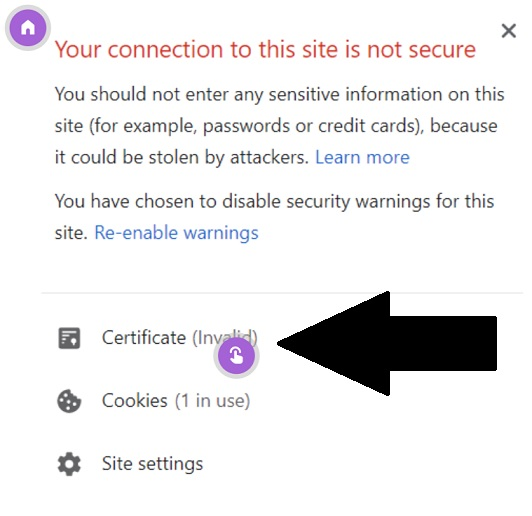
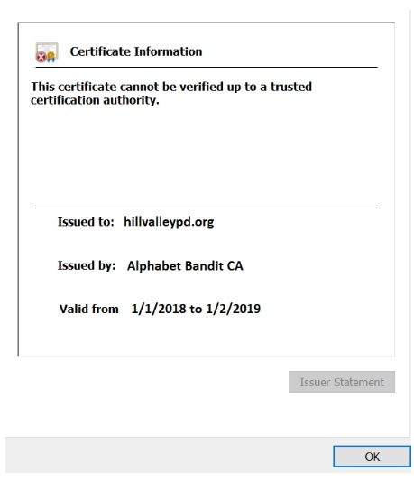

## Solution Guide: SSL Certificates 

This activity showed how SSL certificates can assist with the authentication of a website.  You explored a mock website's SSL certificate and learned how even if a site has a certificate, it can still be inauthentic.

---

- First, open [the webpage that was sent to the officers]( https://view.genial.ly/5defb03224596c0fff13c3a2/interactive-image-interactive-image).
      
    - Remember, the officers found this website suspicious because the official website is hillvalleypd.com.
 
 - View the certificate of the website. To do this, click on the purple icon next to the website.
 
    
 
 - There is a clear warning of an issue with certificate and the website.
 
    
  
  - To further view the details, click on the purple icon next to **Certificate (Invalid)**.
  
  - This displays the certificate details header, with several tabs available for viewing.
  
  - Begin by viewing the **General** tab.
  
    
  
  - We can see that this is invalid because the root authority that issued the certificate is not trusted by the browser.
  
  - Also, the certificate is expired.
  
    
   
- Close this page by clicking the **x**. Click on **Certification Path**.
   
    
   
- This clearly shows that while a certificate was issued, the issuing root authority's name is highly suspicious:
   - No Verification Certificate Authority 
- The intermediate certificate authority name is also suspicious: 
   - Alphabet Bandit Certificate Authority
           
            
           
  - What is the root certificate for this website?
      -  No Verification Certificate Authority

  - What is the intermediate certificate for this website?
      -  Alphabet Bandit Certificate Authority

  - Why is the browser giving a warning about the certificate?
      - Because the root issuing certificate authority is fraudulent, and not in the browser's root store.
   
- Sample summary and recommended communication:
   
   - "Captain Strickland, I have determined that the emails our detectives have been receiving are phishing emails. The website hillvalleypd.org is fraudulent, and while it has a certificate, it was issued by an illegitimate root and illegitimate intermediate certificate authority. 
   
      I recommend we provide a warning message bulletin to all of our staff to be aware of all suspicious emails and websites, and to verify if certificates are legitimate on any website being accessed. Also, don't forget to digitally sign your message."
  ---
   © 2022 edX Boot Camps LLC. Confidential and Proprietary. All Rights Reserved.
