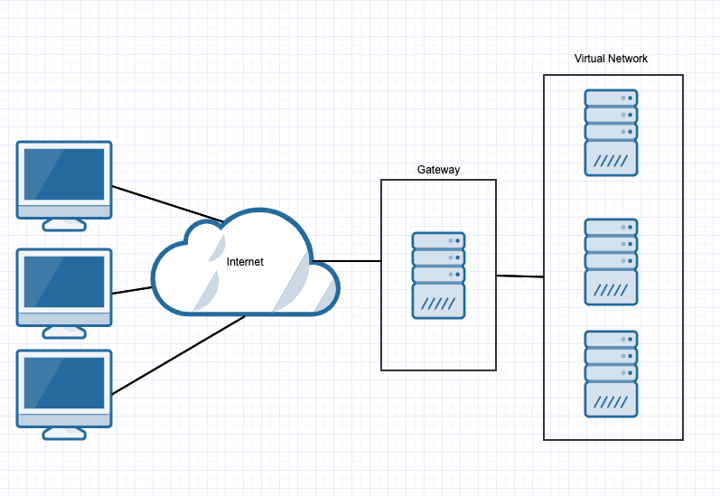
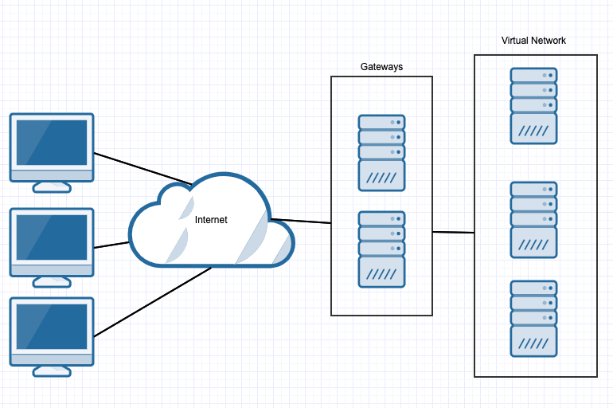
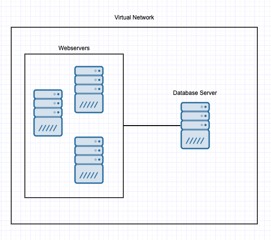
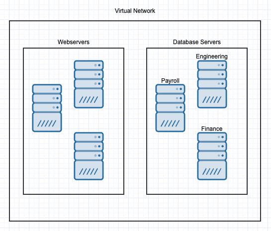
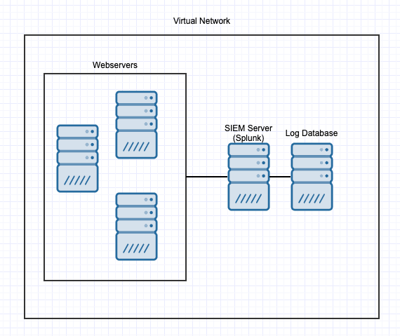

## Activity File: Cloud Architecture

In this activity, you are a cloud architect in charge of creating a new cloud network.

- It is helpful to diagram your network before you start building, so you have a blueprint of what you’re trying to build. Building a strong, secure network requires careful planning and consideration of what servers will provide what function.

- You will be presented with several network options and must choose the best option for each scenario. 

### Instructions 

For each category below, list pros and cons for each category. Then, choose which one you prefer, and provide a one- or two-sentence summary explaining why.

Your pros, cons, and justifications should consider:
<<<<<<< HEAD
=======

>>>>>>> 8dbd11e1b6308442aac1e17388e8d1dd6c3c8679
- Fault tolerance: If a machine goes down unexpectedly, which setup is more robust against the failure?

- Cost: Is either architecture clearly more expensive?

- Complexity: Is either architecture considerably harder to set up or maintain?

<<<<<<< HEAD
- Containment capacity: If a breach _does_ occur, which architecture better ensures attackers can’t move around the network at will?
=======
- Containment capacity: If a breach **does** occur, which architecture better ensures attackers can’t move around the network at will?
>>>>>>> 8dbd11e1b6308442aac1e17388e8d1dd6c3c8679

Not all of these factors will be relevant to all architectures, but you should keep them all in mind as you consider each one. 

#### Gateways

Example 1: This setup uses one gateway to access the network.

Example 2: This setup uses two gateways to access the network.

What are the pros and cons of each example and which do you prefer?

---
<<<<<<< HEAD
=======

>>>>>>> 8dbd11e1b6308442aac1e17388e8d1dd6c3c8679
#### Databases

Example 1: This setup uses a single database for an organization.

Example 2: This setup splits up databases for each department into separate servers.

What are the pros and cons of each example and which do you prefer?

---
<<<<<<< HEAD
=======

>>>>>>> 8dbd11e1b6308442aac1e17388e8d1dd6c3c8679
#### Logs

Example 1: This setup has logs from each web server sent to a SIEM server, which saves logs to its database located on a separate server. 

Example 2: This setup sends logs directly to a log server. 

What are the pros and cons of each example and which do you prefer?

---
<<<<<<< HEAD
© 2020 Trilogy Education Services, a 2U, Inc. brand. All Rights Reserved.
=======

© 2023 edX Boot Camps LLC. Confidential and Proprietary. All Rights Reserved.
>>>>>>> 8dbd11e1b6308442aac1e17388e8d1dd6c3c8679
