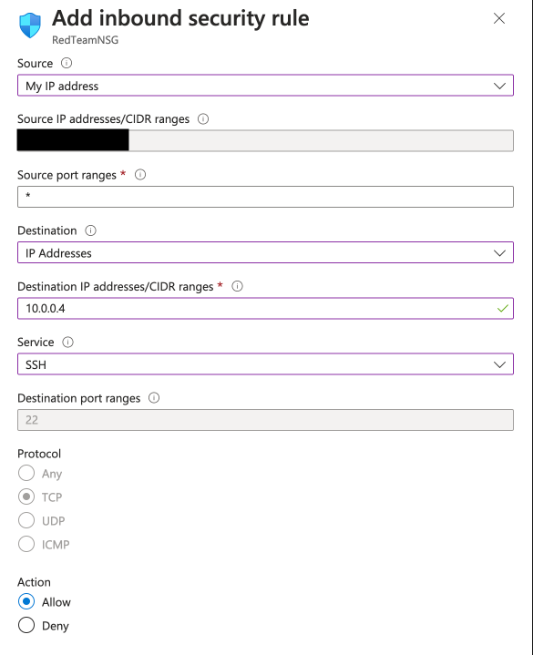

## Solution Guide: Jump Box Administration

The goal of this activity was to create a security group rule to allow SSH connections only from your current IP address, and to connect to your new virtual machine for management.

---

1. First, find your IP address by opening the terminal and entering the command `curl icanhazip.com`, or googling "What's my IP address?" 

<<<<<<< HEAD

=======
>>>>>>> 8dbd11e1b6308442aac1e17388e8d1dd6c3c8679
Next, log into portal.azure.com to create a security group rule to allow SSH connections from your current IP address.

2. Find your security group listed under your resource group.

3. Create a rule allowing SSH connections from your IP address. 

    - Choose **Inbound security rules** on the left.

    - Click **+ Add** to add a rule.

<<<<<<< HEAD
        - Source: Use the **IP Addresses** setting, with your IP address in the field.

        - Source port ranges: Set to **Any** or * here.

		- Destination: This can be set **VirtualNetwork** but a better setting is to specify the internal IP of your jump box to really limit this traffic.

        - Service: Set to **SSH**

        - Destination port ranges: This will default to port `22` as we selected SSH for the service
=======
        - Source: Use the **My IP address** setting.

        - Source port ranges: Set to **Any** or * here.

		- Destination: This can be set **Service Tag**/**Virtual Network** but a better setting is to specify the internal IP of your jump box to really limit this traffic.

        - Service: Set to **SSH**

        - Destination port ranges: This will default to port `22` as we selected SSH for the service.
>>>>>>> 8dbd11e1b6308442aac1e17388e8d1dd6c3c8679

        - Protocol: This will default to **TCP**.

        - Action: Set to **Allow** traffic.

<<<<<<< HEAD
        - Priority: This must be a lower number than your rule to deny all traffic, i.e., less than 4,096. 
=======
        - Priority: This must be a lower number than your rule to deny all traffic (i.e., less than 4,096). 
>>>>>>> 8dbd11e1b6308442aac1e17388e8d1dd6c3c8679

        - Name: Name this rule anything you like, but it should describe the rule. For example: `SSH`.

        - Description: Write a short description similar to: "Allow SSH from my IP." 

<<<<<<< HEAD

	

=======
	
>>>>>>> 8dbd11e1b6308442aac1e17388e8d1dd6c3c8679

4. Use your command line to SSH to the VM for administration. Windows users should use GitBash.

    - The command to connect is `ssh admin-username@VM-public-IP`.

    - Use the username you previously set up. (Your SSH key should be used automatically.)

5. Once you are connected, check your `sudo` permissions.
    
    - Run the command `sudo -l`.

    - Notice that your admin user has full `sudo` permissions without requiring a password.

Please note that your public IP address will change depending on your location. 

-  In a normal work environment, you would set up a static IP address to avoid continually creating rules to allow access to your cloud machine. 

 - In our case, you will need to create another security rule allowing your home network to access your Azure VM. 

<<<<<<< HEAD

**NOTE:** If you need to reset your SSH key, you can do so in the VM details page by selecting 'Reset Password' on the left had column.

---
© 2020 Trilogy Education Services, a 2U, Inc. brand. All Rights Reserved. 
=======
**NOTE:** If you need to reset your SSH key, you can do so in the VM details page by selecting "Reset Password" on the left-hand column.

---

© 2023 edX Boot Camps LLC. Confidential and Proprietary. All Rights Reserved. 
>>>>>>> 8dbd11e1b6308442aac1e17388e8d1dd6c3c8679
