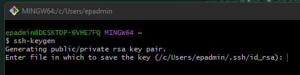
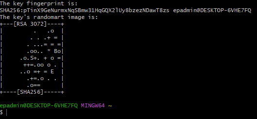
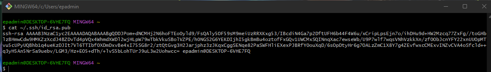
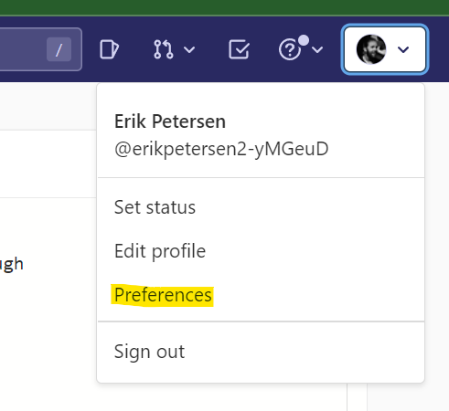
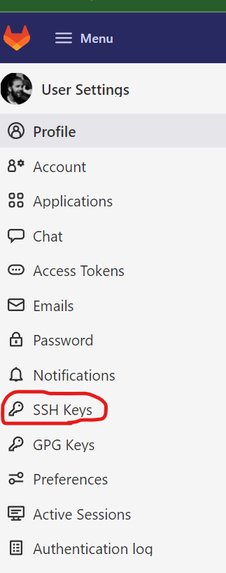
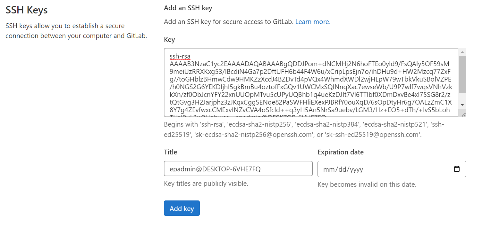
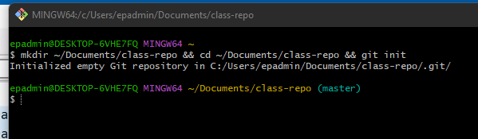
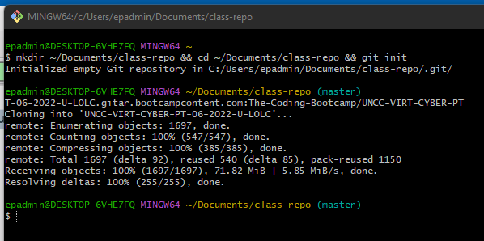
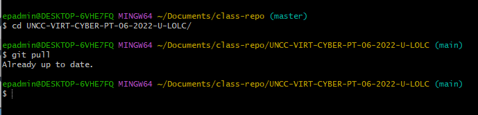

# Cloning the GitLab Repository To Your Local Machine

If you would like access to your GitLab repository when you do not have an internet connection, you can clone your repository to your local machine following the instructions below. As a brief overview, this guide will walk you through 

1. Creating an SSH key on your local machine
2. Uploading your public SSH key to GitLab
3. Creating a directory on your local machine and preparing it to house a GitLab repository
4. Clone the GitLab repository to your local machine
5. Learn how to periodically update your local copy to keep it up to date with new content

# 1. Creating an SSH key on your local machine

To create an SSH (secure shell) key, the first thing we need to do is open Git Bash. Once you have Git Bash open, run the command `ssh-keygen` to create a public/private key pair: 

Press `ENTER` through all the prompts until Git Bash returns a random image value and returns you to the command prompt: 

Congratulations! You've created your first (probably) SSH key!

# 2. Uploading your public SSH key to GitLab

Now that we have our public/private key pair, let's get it uploaded to GitLab. To upload the key to GitLab, the first thing we're going to do is get the contents of our public key. To do this, run the command `cat ~/.ssh/id_rsa.pub` in Git Bash: 

Next, we're going to log into GitLab and go to our Preferences tab: 

From there, on the navigation bar on the left-hand side, click "SSH Keys."

From there, copy/paste your public SSH key to GitLab in the provided text box and name the key something that will help you remember it's for your host machine. If you want your key to expire after a certain date, you can enter that date in the field provided. If
you do not want your SSH key to expire, leave the expiration date blank:

Once you've pasted your public key into the text box and given it a name, click "Add key."

# 3. Creating a directory  on your local machine and preparing it to house a GitLab repository

Back in Git Bash, run the command `mkdir ~/Documents/class-repo && cd ~/Documents/class-repo && git init` to create a directory in your Documents folder called "class-repo," change directories into the directory you just created, and then initialize the directory 
to house a GitHub or GitLab repository. 

# 4. Clone the GitLab repository to your local machine

Now that we have a folder to hold the repository and we've initialized it to interface with GitLab/GitHub, it's time to clone the repository! To do so, make sure you're in the directory `~/Documents/class-repo` and run the command 
`git clone git@unchar.bootcampcontent.com:The-Coding-Bootcamp/VU-VIRT-CYBER-PT-04-2023-U-LOLC.git`. This should clone the GitLab repository to your local machine in the folder you created: 

Voila! You know have a local copy of our GitLab repository on your machine! No more excuses not to turn in homework!!!

# 5. Learn how to periodically update your local copy to keep it up to date with new content

So having a local copy of our GitLab repository is cool, but it's not going to be particularly helpful if it's not up to date with the current version of the repository. To ensure that everything is up to date, any time you are referencing or using your local 
repository, the first thing you should do is run the command `git pull` to sync your local repository with the current version published to GitLab: 

That's it! You're done! Now, regardless of internet connectivity, you should have access to the latest copy of our repository on your machine. If you have any questions, please reach out to James or one of the TAs for assistance. 
